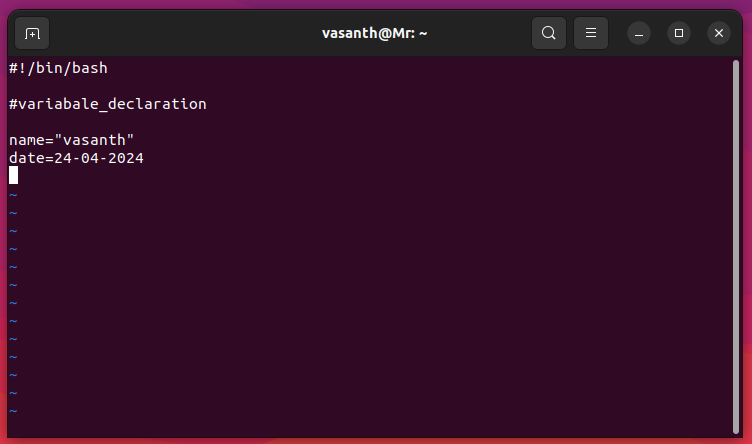
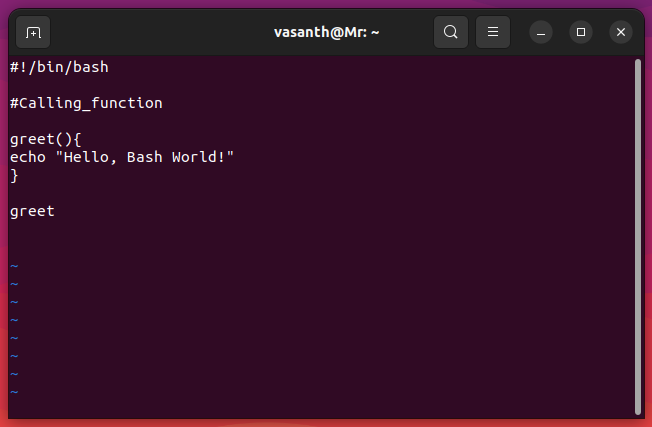
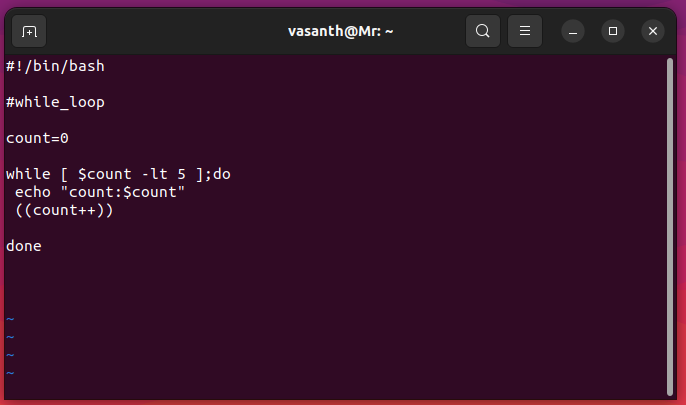
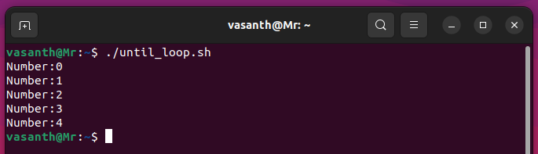
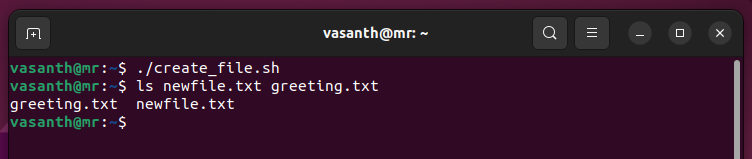
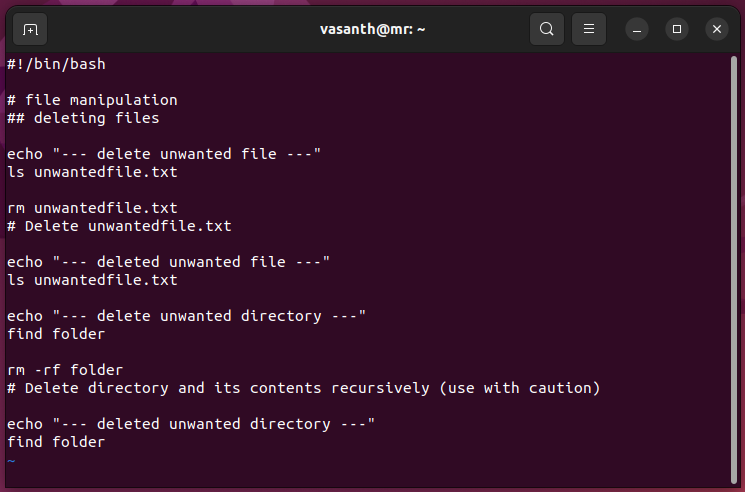
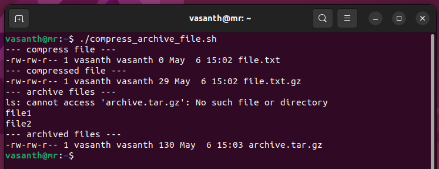
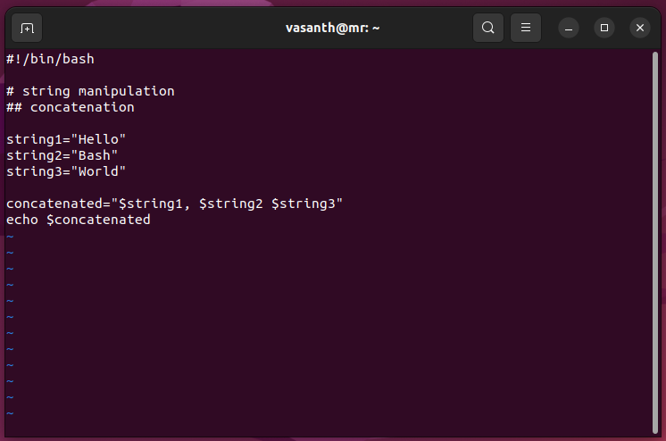
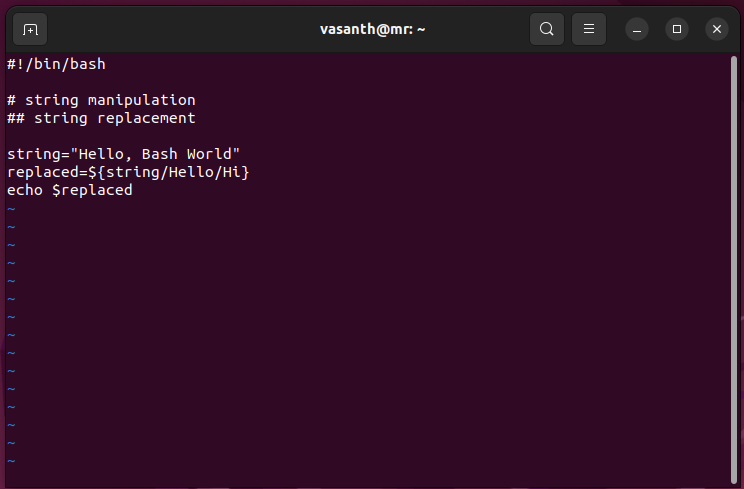

# Bash Scripting

the Bash shell in a Linux environment.

## Introduction to Bash

Bash (Bourne Again Shell) is the default shell in most Linux distributions. It provides a powerful command-line interface for interacting with the operating system and running scripts.

## Why does a script have to start with #!?

The `#!` (shebang) sequence at the beginning of a script serves as an instruction to the system on how to execute the script. Here's why it's necessary:

1. **Identifies the Interpreter**: The `#!` sequence is followed by the path to the interpreter (e.g., `/bin/bash`, `/usr/bin/python`, etc.) that should be used to execute the script. This tells the system which program should interpret and execute the commands within the script.

2. **Ensures Portability**: Including the shebang line makes the script more portable across different systems. Even if the interpreter is located in a different directory on another system, the system will use the interpreter specified in the shebang line.

3. **Defines the Script's Language**: The shebang line also specifies the scripting language of the script. For example, `#!/bin/bash` indicates that the script is written in the Bash scripting language.

4. **Execution Permission**: Without the shebang line, the script may not execute properly or may be interpreted by the wrong program. The shebang line ensures that the script is executed with the intended interpreter.

In summary, the shebang line at the beginning of a script is essential for specifying the interpreter to use when executing the script, ensuring portability, defining the scripting language, and enabling proper execution of the script.

## Creating a Bash Script

Learn the basic steps to create and run a Bash script.

### Steps:

1. **Create a New File**: Open a terminal and type the following command to create a new file with the `.sh` extension using the `vi` text editor:
   
   ```bash
   vi myscript.sh
   ```
   
   This command will open the `vi` editor with a new file named `myscript.sh`.


2. **Write Your Script**: Once the file is opened in `vi`, you can start writing your Bash commands. Press `i` to enter insert mode, then start typing your script. Here's a simple example:

   ```bash
   #!/bin/bash
   
   # This is a simple Bash script
   echo "Hello, Bash World!"
   ```

   After writing your script, press `Esc` to exit insert mode, then type `:wq` and press `Enter` to save and exit `vi`.


3. **Set Execution Permission**: Make the script executable using the `chmod` command:
   
   ```bash
   chmod +x myscript.sh
   ```

   This command gives execute permission to the script file.


4. **Run the Script**: Execute the script using `./` followed by the script name:
   
   ```bash
   ./myscript.sh
   ```

   This command runs the script, and you should see the output "Hello, World!" printed in the terminal.


By following these steps and using the `vi` editor, you can easily create and run Bash scripts to automate tasks or perform various operations in the Linux environment.

## Basic Syntax

Understand the fundamental elements of Bash scripting syntax.

### Variables

Learn how to define and use variables to store data.

Variables in Bash are used to store data such as strings, numbers, or other values. They provide a way to reference and manipulate data throughout a script. Here's how you define and use variables in Bash:

#### Variable Declaration
Variables in Bash are typically declared by assigning a value to them. Unlike some other programming languages, you don't need to specify a data type for a variable in Bash. Here's a simple example:

 ```bash
name="vasanth"
date=24-04-2024
```
In this example, name is assigned the string value "vasanth", and date is assigned the numeric value 24-04-2024.



#### Variable Naming Convention
When naming variables in Bash, it's recommended to use descriptive names that reflect their purpose. Variable names can consist of letters, numbers, and underscores (_), but they must start with a letter or an underscore. Additionally, variable names are case-sensitive.

#### Variable Usage
You can reference the value of a variable using the $ symbol followed by the variable name. Here's how you use variables in Bash commands:

```bash
echo "Name: $name"
echo "date: $date"
```


```bash
This will output:

Name:vasanth
date:24-04-2024
```


#### Read-Only Variables
You can declare a variable as read-only using the readonly command. Once a variable is marked as read-only, its value cannot be changed. Here's an example:

```bash
readonly readonly_var="This variable is read-only"
readonly_var="New value" # This will result in an error
```


#### Environment Variables
Bash also provides access to environment variables, which are variables that are predefined by the operating system or the shell itself. You can access environment variables using the $ symbol followed by the variable name. For example:

```bash
echo "Home directory: $HOME"
echo "Current user: $USER"
```


These commands will display the home directory and the current user, respectively.

use variables in Bash is fundamental for writing effective scripts. They allow you to store and manipulate data dynamically, making your scripts more versatile and powerful.

### Functions

Explore the creation and usage of functions for modularizing script code.

Functions in Bash scripting provide a way to encapsulate a sequence of commands into a single block of code that can be reused throughout the script. Let's explore how to create and use functions:

#### Declaration

To declare a function in Bash, you use the following syntax:

```bash
function_name() {
    # commands
}
```

Here's an example of defining a simple function called `greet`:

```bash
greet() {
    echo "Hello, Bash World!"
}
```


#### Calling Functions

Once a function is defined, you can call it by simply typing its name followed by parentheses. Here's how you call the `greet` function:

```bash
greet
```


#### Passing Arguments to Functions

You can pass arguments to functions in Bash. Within the function, these arguments are accessed using special variables `$1`, `$2`, etc. Here's an example:

```bash
greet() {
    echo "Hello, $1!"
}

# Call the function with an argument
greet "i'm Mr.Cloud Explorer"
```


This will output "Hello, i'm Mr.Cloud Explorer!".


#### Returning Values from Functions

Bash functions can return values using the `return` statement. The return value can be accessed using the special variable `$?`. Here's an example:

```bash
add() {
    local result=$(( $1 + $2 ))
    return $result
}

# Call the function and capture the return value
add 5 3
sum=$?

echo "The sum is $sum"
```


This will output "The sum is 8".


#### Local Variables

Variables declared within a function are local to that function by default. They are not accessible outside the function. To declare a variable as local explicitly, use the `local` keyword. Example:

```bash
greet() {
    local name="Bash World"
    echo "Hello, $name!"
}

greet
```


This will output "Hello,Bash World!"


#### Function Scope

Functions have their own scope in Bash. Variables declared outside a function (global variables) are accessible inside the function, but variables declared inside a function are not accessible outside it.

### Conditional Statements

Learn how to use conditional statements like `if`, `elif`, and `else` for decision-making in scripts.

Conditional statements in Bash scripting allow you to make decisions and execute different parts of code based on specified conditions. Let's explore how to use conditional statements such as `if`, `elif`, and `else`:

#### `if` Statement

The `if` statement in Bash allows you to execute a block of code if a specified condition is true. Here's the basic syntax:

```bash
if [ condition ]; then
    # code to execute if condition is true
fi
```

For example:

```bash
if [ "$age" -ge 18 ]; then
    echo "You are an adult."
fi
```


In this example, if the variable `age` is greater than or equal to 18, the message "You are an adult." will be printed.


#### `elif` Statement

The `elif` statement allows you to check additional conditions if the initial `if` condition is false. Here's the syntax:

```bash
if [ condition1 ]; then
    # code to execute if condition1 is true
elif [ condition2 ]; then
    # code to execute if condition2 is true
else
    # code to execute if all conditions are false
fi
```

For example:

```bash
if [ "$age" -ge 18 ]; then
    echo "You are an adult."
elif [ "$age" -ge 13 ]; then
    echo "You are a teenager."
else
    echo "You are a child."
fi
```


In this example, if the `age` is between 13 and 17 (inclusive), the message "You are a teenager." will be printed.


#### `else` Statement

The `else` statement is used to execute a block of code if none of the previous conditions in the `if` statement or `elif` statements are true. Here's the syntax:

```bash
if [ condition ]; then
    # code to execute if condition is true
else
    # code to execute if condition is false
fi
```

For example:

```bash
if [ "$status" = "success" ]; then
    echo "Operation successful."
else
    echo "Operation failed."
fi
```


In this example, if the `status` variable is equal to "success", the message "Operation successful." will be printed; otherwise, "Operation failed." will be printed.


Conditional statements are powerful tools for implementing decision-making logic in Bash scripts, allowing your scripts to respond dynamically to different situations.

### Loops

Understand different types of loops such as `for` and `while` for repetitive tasks in scripts.

Loops in Bash scripting allow you to execute a block of code repeatedly. There are different types of loops available, such as `for`, `while`, and `until`. Let's explore how to use these loops:

#### `for` Loop

The `for` loop is used to iterate over a list of items and execute a block of code for each item in the list. Here's the basic syntax:

```bash
for item in list; do
    # code to execute for each item
done
```

For example:

```bash
for num in 1 2 3 4 5; do
    echo "Number: $num"
done
```


In this example, the loop will iterate over the numbers 1 through 5 and print each number.


#### `while` Loop

The `while` loop is used to execute a block of code repeatedly as long as a specified condition is true. Here's the basic syntax:

```bash
while [ condition ]; do
    # code to execute while condition is true
done
```

For example:

```bash
count=0
while [ $count -lt 5 ]; do
    echo "Count: $count"
    ((count++))
done
```



In this example, the loop will continue executing as long as the value of the `count` variable is less than 5.


#### `until` Loop

The `until` loop is similar to the `while` loop, but it continues executing until a specified condition becomes true. Here's the basic syntax:

```bash
until [ condition ]; do
    # code to execute until condition becomes true
done
```

For example:

```bash
num=0
until [ $num -ge 5 ]; do
    echo "Number: $num"
    ((num++))
done
```


In this example, the loop will continue executing until the value of the `num` variable is greater than or equal to 5.



Loops are powerful tools for automating repetitive tasks in Bash scripts, allowing you to process data efficiently and perform complex operations.

## Advanced Topics

Explore advanced features and techniques in Bash scripting.

### File Manipulation

Discover commands and techniques for creating, reading, writing, and managing files.

File manipulation is a fundamental aspect of Bash scripting, allowing you to perform various operations on files, such as creating, reading, writing, and managing them. Let's explore some commands and techniques for file manipulation:

#### Creating Files

You can create new files using the `touch` command or by using redirection operators with `echo` or `cat` commands. For example:

```bash
touch newfile.txt           
# Create an empty file named newfile.txt

echo "Hello, Bash World!" > greeting.txt   
# Create a file greeting.txt with content
```


This is the output of that script



#### Reading Files

To read the contents of a file, you can use commands like `cat`, `head`, `tail`, or `less`. For example:

```bash
echo "---dispalyed entire contents---"

cat filename.txt        
#Display the entire contents of filename.txt

echo "---dispalyed first 3 lines---"

head -n 3 filename.txt    
# Display the first 10 lines of filename.txt

echo "---dispalyed last 3 lines---"

tail -n 3 filename.txt    
# Display the last 20 lines of filename.txt
```


This is the output of that script


#### Writing to Files

You can write content to files using redirection operators (`>` or `>>`) with `echo` or `cat` commands. For example:

```bash
echo "Some content" > output.txt
# Write content to output.txt (overwrite if exists)

echo "--- written content ---"
cat output.txt

echo "More content" >> output.txt
# Append content to output.txt

echo "--- append content ---"
cat output.txt
```


This is the output of that script


#### Copying, Moving, and Renaming Files

The `cp` command is used to copy files, `mv` command to move or rename files. For example:

```bash
# file manipulation
## copying, moving, and renameing files

cp source.txt destination.txt
# Copy source.txt to destination.txt

echo "--- copyed file ---"
ls source.txt destination.txt

mv oldfile.txt newfile.txt
# Rename oldfile.txt to newfile.txt

echo "--- renamed file ---"
ls oldfile.txt newfile.txt

mv file.txt folder/file.txt
# Move file.txt to a different directory

echo "--- moved file ---"
ls file.txt
ls folder/file.txt
```


This is the output of that script


#### Deleting Files

To delete files, you can use the `rm` command. Be cautious when using `rm` as it permanently deletes files. For example:

```bash
echo "--- delete unwanted file ---"
ls unwantedfile.txt

rm unwantedfile.txt
# Delete unwantedfile.txt

echo "--- deleted unwanted file ---"
ls unwantedfile.txt

echo "--- delete unwanted directory ---"
find folder

rm -rf directory
# Delete directory and its contents recursively (use with caution)

echo "--- deleted unwanted directory ---"
find folder
```



This is the output of that script


#### Permissions and Ownership

Use the `chmod` command to change file permissions and the `chown` command to change file ownership. For example:

```bash
echo "--- add permission 'e' ---"
ls -la script.sh

chmod +x script.sh
# Add execute permission to script.sh

echo "--- added permission 'e' ---"
ls -la script.sh

echo "--- add ownership ---"
ls -la file.txt

sudo chown user:group file.txt
# Change the owner and group of file.txt

echo "--- added ownership ---"
ls -la file.txt
```


This is the output of that script


#### File Compression and Archiving

You can compress files using commands like `gzip`, `bzip2`, or `zip`, and archive files using the `tar` command. For example:

```bash
echo "--- compress file ---"
ls -l file.txt

gzip file.txt
# Compress filename.txt using gzip

echo "--- compressed file ---" 
ls -l file.txt.gz

echo "--- archive files ---" 
ls -l archive.tar.gz

tar -czvf archive.tar.gz file1 file2
# Create a gzipped tar archive containing file1 and file2

echo "--- archived files ---" 
ls -l archive.tar.gz
```


This is the output of that script



File manipulation commands and techniques in Bash scripting are essential for working with files efficiently and managing file operations effectively.

### String Manipulation

Learn about string manipulation operations such as concatenation, substring extraction, and pattern matching.

String manipulation in Bash scripting involves various operations for manipulating strings, such as concatenation, substring extraction, and pattern matching. Let's explore some common string manipulation techniques:

#### Concatenation

You can concatenate strings using the concatenation operator (`+`) or by simply placing them next to each other. For example:

```bash
string1="Hello"
string2="Bash" 
string3="World"

concatenated="$string1, $string2 $string3"
echo $concatenated
```



This is the output of that script


#### Substring Extraction

To extract a substring from a string, you can use parameter expansion with the `${string:position:length}` syntax. For example:

```bash
string="Hello, Bash World"
substring=${string:0:5}
echo $substring 
```


This is the output of that script


#### Length of a String

To find the length of a string, you can use parameter expansion with the `${#string}` syntax. For example:

```bash
string="Hello, Bash World"
length=${#string}
echo $length 
```


This is the output of that script


#### Pattern Matching

Pattern matching allows you to match and manipulate strings based on specific patterns or regular expressions. You can use tools like `grep`, `sed`, and `awk` for pattern matching operations. For example:

```bash
string="Hello, Bash World"
if [[ $string =~ ^Hello ]]; then
    echo "String starts with 'Hello'"
fi
```

In this example, the `=~` operator is used to match the string against the regular expression `^Hello`, which checks if the string starts with "Hello".


This is the output of that script


#### String Replacement

You can replace substrings within a string using parameter expansion with the `${string/pattern/replacement}` syntax. For example:

```bash
string="Hello, World"
replaced=${string/Hello/Hi}
echo $replaced
```



This is the output of that script


String manipulation operations in Bash scripting allow you to manipulate and transform strings effectively, enabling you to perform complex text processing tasks within your scripts.

### Command Substitution

Understand how to use command substitution to capture and use the output of commands within scripts.

### Error Handling

Explore strategies for handling errors and unexpected conditions in scripts.

Error handling is an essential aspect of Bash scripting, allowing you to gracefully handle errors and unexpected conditions that may occur during script execution. Let's explore some strategies for error handling in Bash scripts:

#### Exit Status

Every command executed in Bash returns an exit status, which indicates whether the command succeeded or failed. By convention, an exit status of 0 indicates success, while a non-zero exit status indicates failure. You can check the exit status of the previous command using the special variable `$?`. For example:

```bash
command
if [ $? -ne 0 ]; then
    echo "Command failed."
fi
```
[Example](bash_snap/.png)

This is the output of that script


#### Error Messages

You can display custom error messages using the `echo` command or redirecting them to standard error (stderr) using file descriptor `2`. For example:

```bash
if [ ! -f filename ]; then
    echo "Error: File not found." >&2
    exit 1
fi
```

[Example](bash_snap/.png)

This is the output of that script


#### Exiting on Error

You can use the `set -e` option to make your script exit immediately if any command exits with a non-zero status. For example:

```bash
set -e
command1
command2
```

[Example](bash_snap/.png)

This is the output of that script


#### Error Handling Functions

You can define functions to handle errors and call them when errors occur. For example:

```bash
handle_error() {
    echo "Error: $1" >&2
    exit 1
}

# Usage
if [ ! -f filename ]; then
    handle_error "File not found."
fi
```

[Example](bash_snap/.png)

This is the output of that script


#### Trap Signals

You can use the `trap` command to trap signals and execute custom error-handling code when a signal is received. For example:

```bash
cleanup() {
    echo "Cleaning up..."
    # Additional cleanup tasks
}

trap cleanup EXIT
```
[Example](bash_snap/.png)

This is the output of that script


Error handling in Bash scripting ensures that your scripts are robust and can gracefully handle unexpected situations, improving reliability and user experience.

### Script Packaging

Packaging Bash scripts involves creating standalone executables, adding documentation, managing dependencies, and distributing scripts as packages or installers.

Packaging Bash scripts allows you to distribute them as standalone executables or packages, making it easier for users to install and use your scripts. Let's explore some techniques for packaging Bash scripts:

#### Standalone Executables

To create a standalone executable from a Bash script, you can use tools like `shc` (Bash script compiler) or `makeself`. These tools bundle your script and its dependencies into a single executable file, making it easy to distribute and execute on different systems.

```bash
shc -f script.sh
```
[Example](bash_snap/.png)

This is the output of that script


#### Adding Documentation

Adding documentation to your Bash scripts improves usability and helps users understand how to use your scripts. You can add comments at the beginning of your script to provide a description, usage instructions, and any other relevant information.

```bash
#!/bin/bash

# Script Name: myscript.sh
# Description: This script performs a specific task.
# Usage: ./myscript.sh [options]
# Options: -h, --help     Display help message
#          -v, --version  Display script version
```

[Example](bash_snap/.png)

This is the output of that script


#### Managing Dependencies

If your script relies on external commands or programs, you should document these dependencies and provide instructions for installing them. You can also check for dependencies programmatically and provide informative error messages if they are missing.

```bash
# Check if required commands are installed
command -v <command> >/dev/null 2>&1 || { echo >&2 "Required command <command> not found. Aborting."; exit 1; }
```

[Example](bash_snap/.png)

This is the output of that script


#### Distributing as Packages or Installers

For more complex scripts or projects with multiple files, you can package them as distribution packages (e.g., `.deb` for Debian-based systems or `.rpm` for Red Hat-based systems) or installers (e.g., `.exe` for Windows). Tools like `fpm` (Effing Package Management) or `debreate` can help you create distribution packages easily.

```bash
fpm -s dir -t deb -n mypackage -v 1.0.0 /path/to/scripts
```

[Example](bash_snap/.png)

This is the output of that script


Packaging Bash scripts simplifies distribution and installation, making your scripts more accessible to users and improving the overall user experience.

Bash scripting automate tasks, create custom tools, and enhance your productivity in the Linux environment. learning the basics, mastering syntax, and exploring advanced topics, you can become proficient in scripting with Bash.

# [Bash Scripting with Real-Time Tasks](tasks/tasks.md)

learn about Bash scripting through real-time Tasks commonly encountered in Linux environments.
