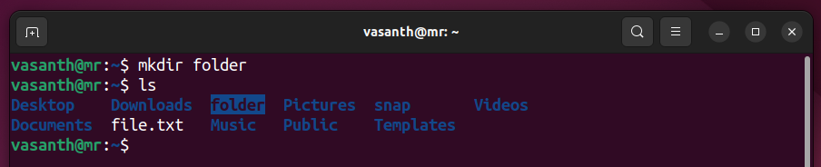
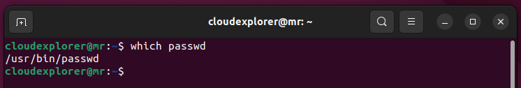
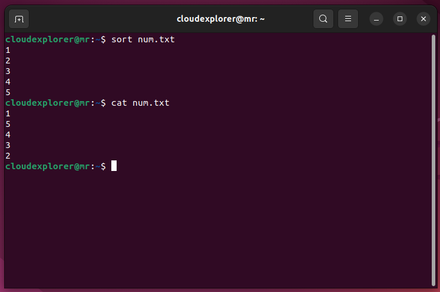
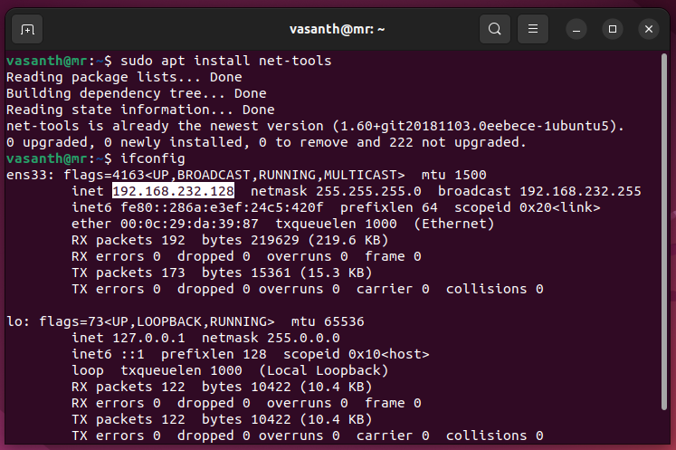
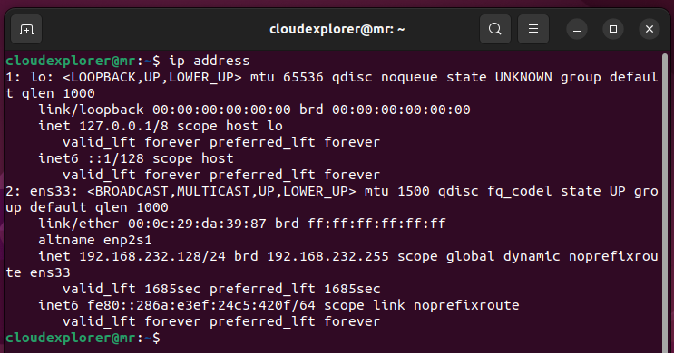
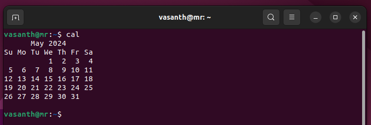
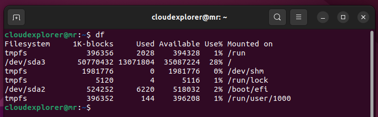

# List of Linux Commands

**whoami**
- This command displays the username of the current user.
  

**ls**
- The ls command lists the contents of a directory.
  

**cd**
- This command changes the current directory.
  

**pwd**
- The pwd command prints the name of the current working directory.
  

**touch**
- This command creates an empty file or updates the timestamp of an existing file.
  

**echo**
- The echo command is used to display a line of text/string that is passed as an argument.
  

**vi**
- This is a text editor in Unix and Linux operating systems.
  

**nano**
- Nano is a text editor for Unix-like computing systems or operating environments.
  

**cat**
- This command is used to concatenate and display the contents of files.
  

**mkdir**
- The mkdir command creates directories.
  

**cp**
- The cp command is used to copy files or directories.
  

**mv**
- The mv command moves files or directories from one place to another.
  

**rmdir**
- This command removes empty directories.
  

**rm**
- The rm command is used to remove files or directories.
  

**ln**
- The ln command is used to create a link to a file or directory.
  

**useradd**
- This command is used to create a new user account.
  

**sudo**
- The sudo command allows a permitted user to execute a command as another user.
  

**adduser**
- This command is used to add a new user to the system.
  

**su**
- The su command is used to switch to another user account.
  

**passwd**
- The passwd command is used to change a user's password.
  

**apt, yum**
- These are package management commands used to install, update, and remove software packages.
  - ubuntu
    
  - centos
    

**update**
- This command is used to update package indexes and software repositories.
  

**upgrade**
- This command is used to upgrade installed packages to their latest versions.
  

**man**
- The man command displays the manual pages for other commands.
  
  

**whatis**
- This command displays a one-line description of a command.
  

**which**
- The which command shows the full path of shell commands.
  

**whereis**
- This command locates the binary, source, and manual page files for a command.
  

**wget**
- This command is used to download files from the internet.
  

**curl**
- The curl command is used to transfer data to or from a server.
  

**zip**
- This command is used to compress files into a zip archive.
  

**unzip**
- The unzip command is used to extract files from a zip archive.
  

**less**
- This command is a file pager that allows backward and forward navigation through text files.
  
  
  

**head**
- The head command displays the first few lines of a file.
  

**tail**
- This command displays the last few lines of a file.
  

**top**
- The top command displays real-time information about system resource usage.
  

**cmp**
- This command compares two files byte by byte.
  

**diff**
- The diff command is used to compare the contents of two files line by line.
  

**sort**
- This command sorts the lines of a text file.
  

**find**
- The find command is used to search for files in a directory hierarchy.
  

**cut**
- This command is used to extract sections from each line of input.
  

**chmod**
- The chmod command changes the permissions of files or directories.
  

**chown**
- This command changes the owner and group of files or directories.
  

**ifconfig**
- The ifconfig command displays information about network interfaces.
  

**ipaddress**
- This command displays the IP address of the system.
  

**grep**
- The grep command is used to search for patterns in text files.
  

**awk**
- The awk command is used for pattern scanning and processing.
  

**ping**
- This command is used to test the reachability of a host on a network.
  

**traceroute**
- The traceroute command traces the route that packets take to reach a destination.
  

**netstat**
- This command displays network connections, routing tables, interface statistics, and more.
  

**alias, unalias**
- These commands are used to create or remove command aliases.
  - 
  - 

**iptables**
- The iptables command is used to set up and maintain packet filtering rules.
  

**ufw**
- This command is used to manage the Uncomplicated Firewall.
  

**uname**
- The uname command prints system information.
  

**neofetch**
- This command displays system information and ASCII art of the system logo.
  

**cal**
- The cal command displays a calendar.
  

**free**
- This command displays information about free and used memory.
  

**tree**
- The tree command displays the directory structure in a tree-like format.
  

**df**
- This command displays information about disk space usage.
  

**du**
- The du command displays information about disk usage by files and directories.
  

**ps**
- This command displays information about currently running processes.
  

**top**
- The top command displays real-time information about system resource usage.
  
---------------------------------------
**kill**
- This command sends signals to processes, allowing them to be terminated or modified.
  

**tar**
- The tar command is used to create, maintain, modify, or extract files from tar archives.
  

**sed**
- This command is a stream editor for filtering and transforming text.
  

**scp**
- The scp command securely copies files between hosts on a network.
  

**dig**
- This command is used to perform DNS lookup operations.
  

**ssh**
- The ssh command is used to establish a secure shell connection to a remote server.
  

**rsync**
- This command is used to synchronize files and directories between two locations.
  

**crontab**
- The crontab command is used to schedule tasks to run periodically.
  

**watch**
- This command runs a specified command repeatedly, displaying its output.
  
  

**jobs**
- The jobs command lists the active jobs in the shell.
  

**locate**
- This command is used to find files by name.
  

**updatedb**
- The updatedb command updates the file database used by locate.
  

**tee**
- This command reads from standard input and writes to standard output and files simultaneously.
  

**xargs**
- The xargs command is used to build and execute command lines from standard input.
  

---------------------------
**systemctl start**
- This command is used to start a systemd unit.
  

**systemctl status**
- This command is used to start a systemd unit.
  

**systemctl stop**
- This command is used to stop a systemd unit.
  

**systemctl restart**
- This command is used to restart a systemd unit.
  

**systemctl enable**
- This command is used to enable a systemd unit.
  

**systemctl disable**
- This command is used to disable a systemd unit.
  

**history**
- The history command displays previously executed commands.
  

**clear**
- This command clears the terminal screen.
  

**exit**
- The exit command is used to exit the shell.
  

**reboot**
- This command reboots the system.
  

**shutdown**
- The shutdown command shuts down the system.
  